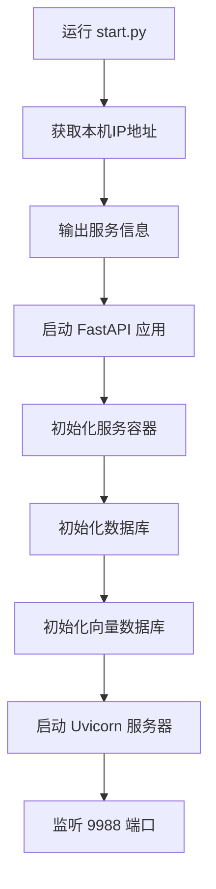
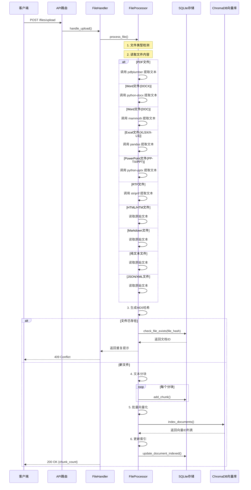
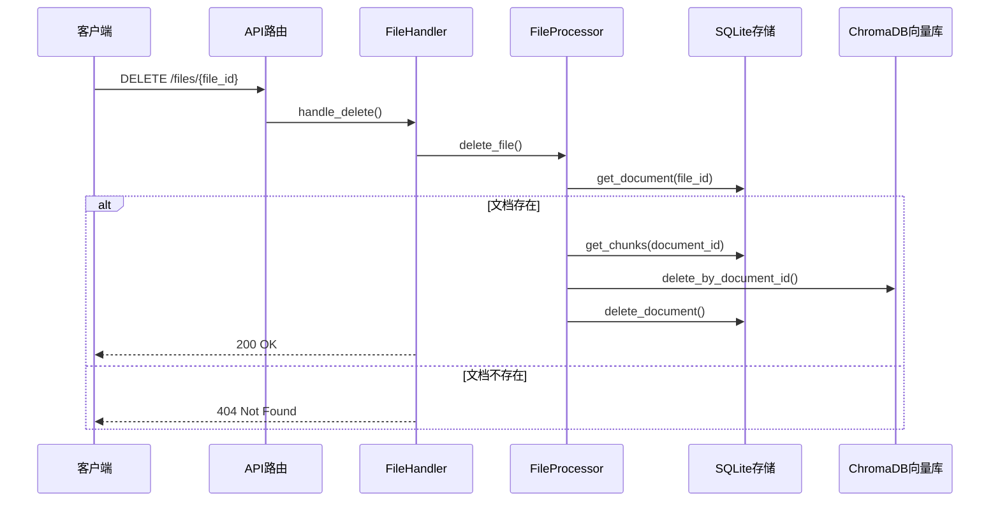
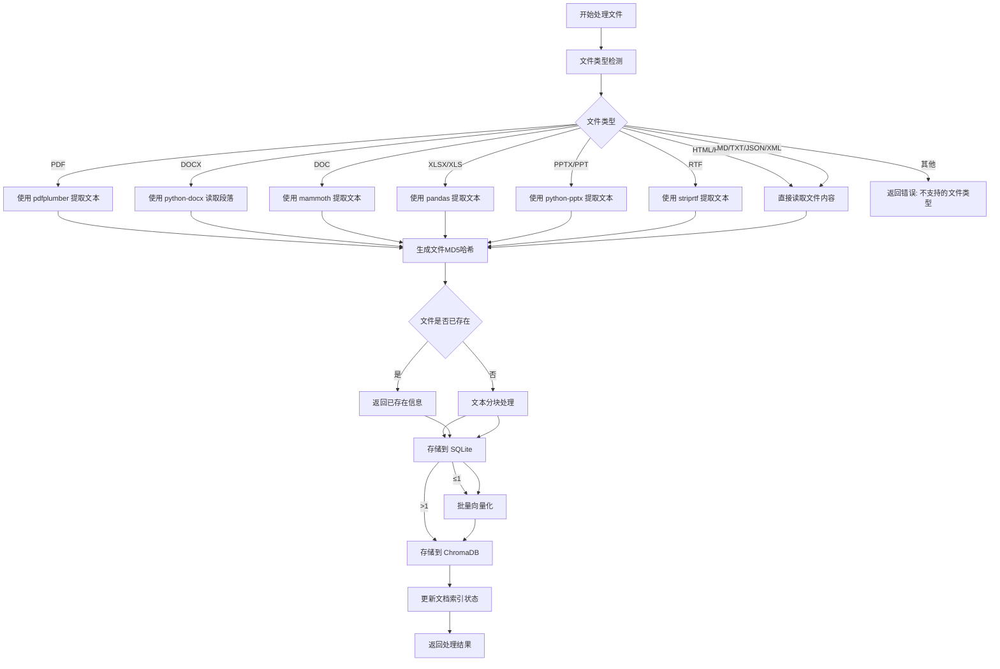
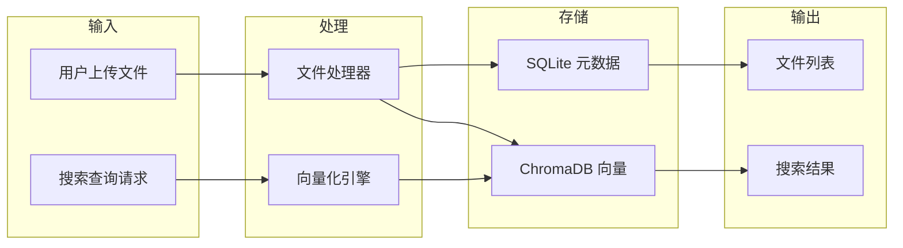
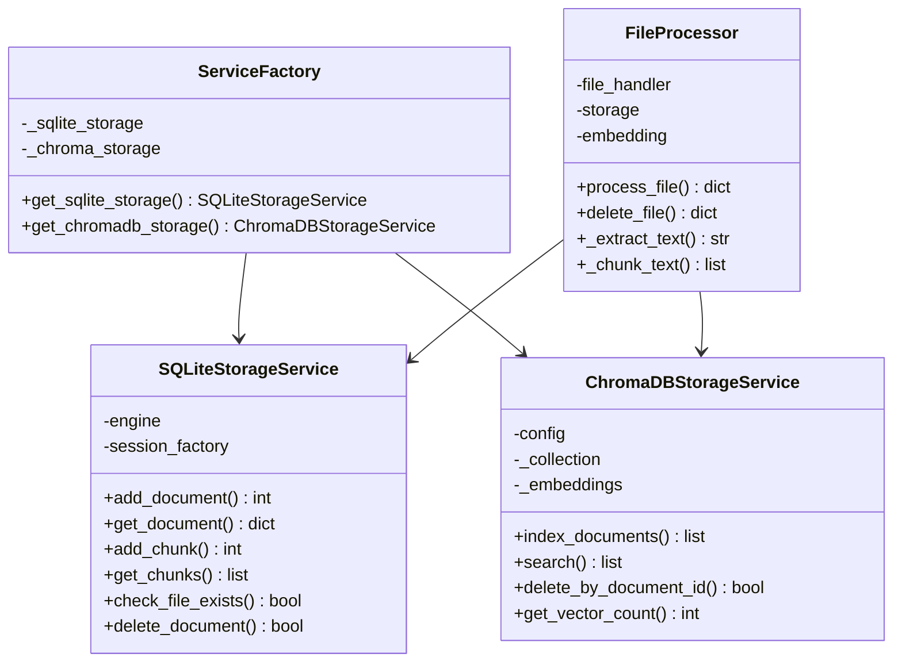
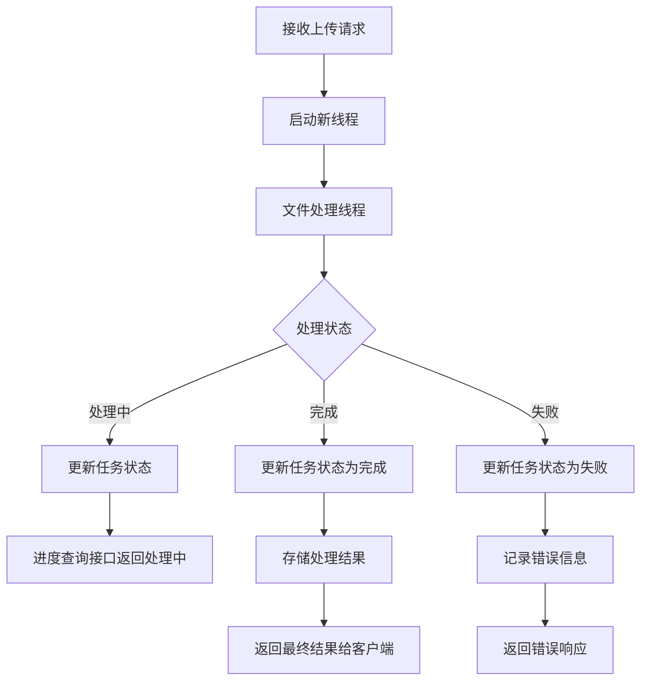

# 系统调用流程图

## 1. 服务启动流程



## 2. 文件上传处理流程



## 3. 语义搜索流程

```mermaid
flowchart TD
    A[客户端请求] --> B[POST GET /search 或 GET /search]
    B --> C{请求类型}
    
    C -->|GET with query param| D[解析查询参数]
    C -->|POST with JSON body| E[解析请求体]
    
    D --> F[SearchHandler.search()]
    E --> F
    
    F --> G{搜索模式}
    
    G -->|简单搜索| H[直接调用 ChromaDB.search]
    G -->|综合搜索| I[获取文档元数据]
    
    I --> J[SQLite: get_documents_by_ids]
    J --> K[合并搜索结果与元数据]
    K --> L[格式化输出]
    
    H --> L
    L --> M[返回搜索结果]
```

## 4. 文件删除流程



## 5. 文件处理核心流程



## 6. 组件依赖关系

```mermaid
flowchart TB
    subgraph 服务层
        SF[ServiceFactory]
    end
    
    subgraph 存储层
        SQLite[SQLiteStorageService]
        ChromaDB[ChromaDBStorageService]
    end
    
    subgraph 处理层
        FP[FileProcessor]
    end
    
    subgraph API层
        FH[FileHandler]
        SH[SearchHandler]
    end
    
    subgraph FastAPI
        App[FastAPI 应用]
        Router[API Router]
    end
    
 Router    App -->
    Router --> FH
    Router --> SH
    
    FH --> FP
    SH --> ChromaDB
    
    FP --> SF
    FH --> SF
    SH --> SF
    
    SF --> SQLite
    SF --> ChromaDB
    
    FP --> SQLite
    FP --> ChromaDB
```

## 7. 数据流向图



## 8. 核心类关系图



## 9. API 端点调用顺序

```mermaid
flowchart TD
    subgraph 启动阶段
        A[start.py] --> B[main.py: init_db]
        B --> C[main.py: lifespan]
    end
    
    subgraph 运行时API调用
        D[POST /files/upload]
        E[GET /files/{file_id}]
        F[DELETE /files/{file_id}]
        G[POST /search]
        H[GET /search]
        I[GET /files]
        J[GET /health]
    end
    
    启动阶段 --> 运行时API调用
```

## 10. 并发处理流程


